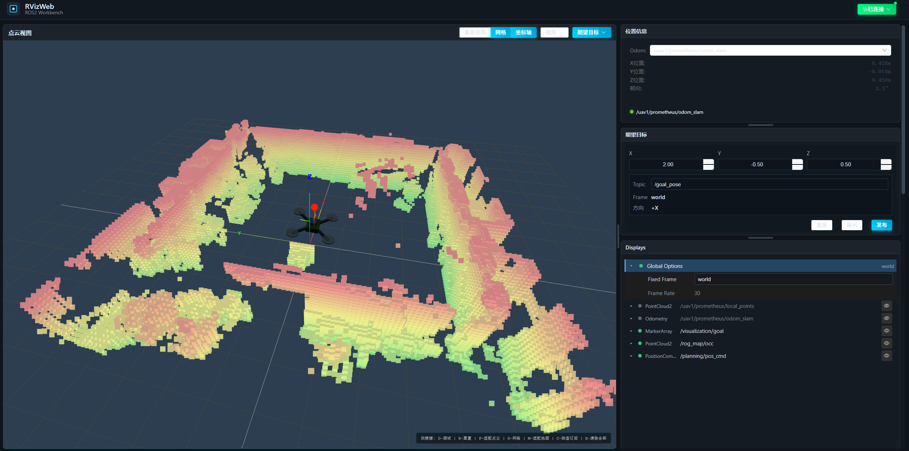
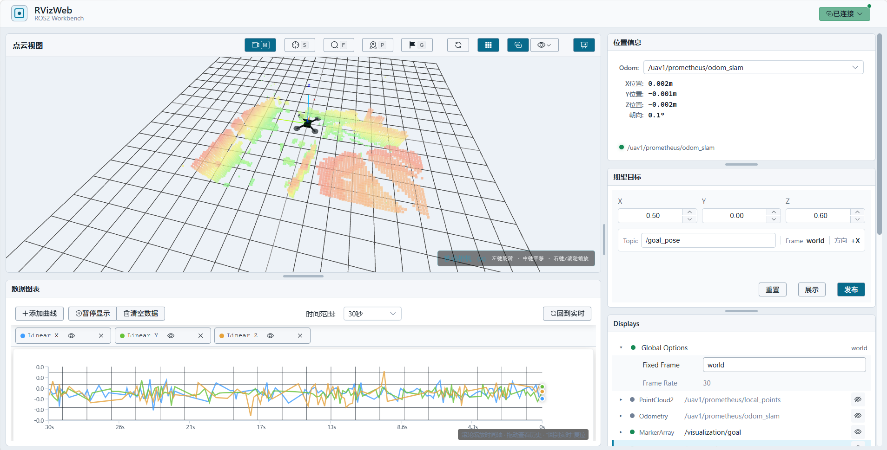

# RVizWeb

> 当前正式版本：`v1.1.1`





[English](./README_en.md)

RVizWeb 是一个面向 ROS2 的浏览器可视化前端，用于查看点云、里程计、路径、Marker 等数据，并提供无人机位姿显示、期望目标输入、实时数据图表和 RViz 风格的 Displays 管理。项目由 Vue 3 + Three.js 前端和 FastAPI + rclpy 后端组成。

## 功能

- RViz 风格 Displays：
  - 从当前 ROS2 图读取话题并添加显示项。
  - 用眼睛图标控制显示/隐藏。
  - 支持添加、删除和修改话题；已添加 Display 的消息类型自动跟随 ROS2 话题，不单独编辑。
  - Add 弹窗支持 `By topic` 和 `By display type`；类型列表只包含当前 ROS2 图中确实存在话题的类型。
  - 隐藏或删除 Display 时同步清理消息缓存，TF 更新不会重新创建已隐藏对象。
  - 每个 Display 可保存独立配置。
- 3D 可视化：
  - `sensor_msgs/msg/PointCloud2`
  - `sensor_msgs/msg/LaserScan`
  - `nav_msgs/msg/Odometry`
  - `nav_msgs/msg/Path`
  - `visualization_msgs/msg/Marker`
  - `visualization_msgs/msg/MarkerArray`
  - `nav_msgs/msg/OccupancyGrid`
  - 自动订阅 `/tf` 和 `/tf_static`，将显示数据转换到选定的 Fixed Frame。
  - 找不到 TF 链时隐藏错误坐标的数据，并在对应 Display 显示原因。
- RViz 风格工具与相机：
  - 顶部工具栏提供移动相机、选择、聚焦、2D 位姿估计和 2D 目标。
  - Orbit 操作为左键旋转、中键平移、右键拖动或滚轮缩放。
  - 快捷键为 `M` 移动、`S` 选择、`F` 聚焦、`P` 2D 位姿、`G` 2D 目标、`Esc` 取消。
  - 选中对象后显示青色包围框；俯视预设使用正交相机。
  - 工具栏支持将当前 3D 画布截图为 PNG。
  - 支持以 30 FPS 录制 3D 画布，再次点击结束并下载 WebM；根据浏览器能力选择 VP9、VP8 或普通 WebM。
  - RTSP 工具按钮采用与系统状态框相同的配置浮层交互；点击按钮只展开地址输入和连接状态，不直接创建视频窗口。
  - 后端 FFmpeg 成功探测到首帧后，才在已保存位置显示无标题、无边框的实时视频；连接失败、超时或没有视频轨道时仅显示系统错误消息。
  - 播放时可直接拖动画面移动位置；编辑、重连、关闭按钮和左右下角缩放控制仅在鼠标悬停时显示。
  - 后端使用 FFmpeg 将 RTSP 转为浏览器可显示的 MJPEG，播放 URL 只包含短期会话 ID。
- 点云与路径样式：
  - PointCloud2 支持按话题选择 `Points` 或 `Boxes` 渲染，并分别设置 `Point Size` 或 `Box Size`。
  - `Boxes` 使用实例化立方体渲染，适合占用体素地图；`Points` 适合高频、大规模实时点云。
  - Path 支持按话题设置线宽和颜色。
  - MarkerArray 支持颜色覆盖和透明度设置；颜色留空时使用消息自身颜色。
- 无人机位姿：
  - 位置面板中选择 odom 话题作为无人机模型位姿来源。
  - 当前 odom 订阅会被保护，避免 Displays 隐藏同名话题后无人机模型停止跟随。
- 期望目标：
  - 在位置信息下方输入目标 `Topic`、`X/Y/Z`。
  - `展示` 只在点云视图中预览目标。
  - `发布` 才向配置的话题发布 `geometry_msgs/msg/PoseStamped`。
  - 默认方向为 `+X`。
  - 发布状态实时读取当前 WebSocket 连接，不会因组件初始化时的旧状态误报未连接。
- 布局与视图：
  - 右侧面板支持手动拖拽高度。
  - 点云视图和右侧功能区比例可保存。
  - 3D 画布会跟随分栏和底部 Dock 尺寸实时调整，避免拖拽后留下空白区域。
  - 网格、坐标轴、视角预设和相机状态可保存。
- 数据图表：
  - 以 3D 视图下方的可调高度 Dock 显示，启动时默认收起。
  - 从当前 ROS2 图中选择 Topic 的数值字段，支持多曲线显隐和删除。
  - 支持 10 秒到 10 分钟时间范围、滚轮缩放、拖动查看历史和回到实时。
  - 暂停只冻结画面，后台仍继续缓存数据。
  - X 轴显示相对时间：短窗口使用秒，1 分钟及以上自动切换为分钟。

> 地图文件设置入口当前暂时隐藏。`nav_msgs/msg/OccupancyGrid` 的底层显示与原有配置字段仍保留，便于后续恢复。

## 话题读取

Displays 添加话题时会读取当前 ROS2 图：

1. 后端优先执行 `ros2 topic list -t` 获取话题和类型。
2. 如果 CLI 不可用或超时，回退到 rclpy 的 topic discovery。
3. 前端 Add 面板和 Topic 下拉框打开时会刷新话题列表，也可以手动点击 `Refresh`。

因此话题来源是当前 ROS2 系统和 `.rvizweb` 配置文件，不来自 `.env` 或前端硬编码默认值。

## 配置文件

配置文件保存在：

```text
rvizweb_configs/*.rvizweb
```

通用配置为：

```text
rvizweb_configs/default.rvizweb
```

`default.rvizweb` 只包含通用界面设置，不绑定具体机器人话题。可以为不同机器人或任务创建独立配置；选择启动配置时使用：

```bash
RVIZWEB_CONFIG=<name>.rvizweb ./start.sh local
```

启动脚本会检查配置文件是否存在以及是否使用 `.rvizweb` 后缀，然后通过 `VITE_RVIZWEB_CONFIG` 交给前端自动读取。

保存配置采用同目录临时文件原子替换，覆盖和删除前的副本保存在 `rvizweb_configs/backups/`。后端会校验配置版本、结构、文件名和大小；配置读取失败时前端保持当前状态不变。

右上角系统状态会显示当前加载的 `.rvizweb` 文件名、是否存在未保存修改以及配置文件的最近保存时间。设置、Displays、布局和相机视角变化都会更新该状态；保存或重新读取成功后恢复为“已保存”。

设置面板支持：

- 保存当前前端状态为 `.rvizweb`
- 读取已有配置
- 删除配置
- 切换深色或浅色主题，并随配置保存
- 自动兼容用户输入的 `.rviz` 后缀并保存为 `.rvizweb`

配置文件主要包含：

- `fixedFrame`
- `followFrame`（可选；相机跟随该 TF frame 的平移，视角不随姿态旋转）
- `scene.showGrid`
- `scene.showAxes`
- `scene.viewPreset`
- `scene.camera`
- `layout.sceneWidth`
- `layout.panelHeights`
- `layout.collapsedPanels`
- `appearance.theme`
- `video.sourceUrl`
- `video.visible`
- `video.layout.x/y/width/height`
- `goal.topic`
- `goal.x/y/z`
- `position.odomTopic`
- `laser`
- `map`
- `displays`

后端配置 API：

```text
GET    /api/v1/configs
GET    /api/v1/configs/{name}
POST   /api/v1/configs/{name}
DELETE /api/v1/configs/{name}
```

RTSP 视频 API：

```text
GET    /api/v1/video/status
POST   /api/v1/video/sessions
GET    /api/v1/video/stream/{session_id}
DELETE /api/v1/video/sessions/{session_id}
```

## 启动

首次使用前，先复制环境配置示例文件并根据实际情况修改：

```bash
cd <your_workspace>/rviz2-web
cp .env.example .env
# 编辑 .env，按需修改端口、ROS_DOMAIN_ID 等配置
```

后端使用 [uv](https://docs.astral.sh/uv/) 管理 Python 环境。首次安装或依赖变化后执行：

```bash
./start.sh sync
```

正常本地启动：

```bash
./start.sh local
```

不传参数时默认也是本地模式：

```bash
./start.sh
```

正常模式会先执行前端生产构建，再用静态预览服务提供页面，不监视源码文件。开发前端并需要热更新时使用：

```bash
./start.sh dev
```

本地模式需要：

- ROS2 环境可用
- Node.js 20.19+
- Python 3.10+
- FFmpeg（用于把浏览器不支持的 RTSP 转为 MJPEG）
- curl（若未安装 `uv`，启动脚本会通过官方安装脚本自动安装）

启动脚本会读取项目根目录 `.env`，加载 ROS2 环境，检查默认 `.rvizweb` 配置以及 `FRONTEND_PORT`、`BACKEND_PORT` 指定的端口，等待前后端健康检查，并把输出统一写入 `logs/`。启动后显示的前端访问主机由 `FRONTEND_PUBLIC_HOST` 配置。启动失败会立即退出；Ctrl+C 会停止整个前后端进程组。

浏览器标签页和页面左上角标题可在 `.env` 中修改：

```env
VITE_APP_TITLE=RVizWeb
```

点击点云视图工具栏中的相机监视器按钮后，会在按钮下方展开连接配置浮层。输入地址并连接，例如：

```text
rtsp://192.168.1.66:8554/1
```

点击“保存”时，RTSP 地址、浮窗开关、位置和大小会写入当前 `.rvizweb` 配置。若地址包含用户名或密码，它们也会以明文保存在配置文件中，请妥善控制文件权限。

“连接”会先等待后端取得有效视频首帧。只有探测成功才显示视频窗口；失败或无画面时不会创建空白窗口，而是通过页面系统消息报告具体错误。

后端转流参数可在 `.env` 中调整：

```env
RTSP_TRANSPORT=tcp
RTSP_FRAME_RATE=12
RTSP_WIDTH=640
RTSP_JPEG_QUALITY=5
RTSP_STARTUP_TIMEOUT=10
RTSP_SESSION_TTL=300
FFMPEG_PATH=ffmpeg
```

正常模式修改后重新执行 `./start.sh` 以重新构建前端；开发模式会随 Vite 重启或环境重新加载后生效。

配置写入默认只允许本机和局域网地址。需要令牌时，在 `.env` 中将 `CONFIG_API_TOKEN` 与 `VITE_CONFIG_API_TOKEN` 设置成相同值。`CORS_ORIGINS` 应列出实际允许访问的前端地址。

脚本会按 `.env` 中 `ROS2_SETUP_PATHS` 的顺序依次 source 各个 setup.bash 文件：

```bash
source /opt/ros/humble/setup.bash
source <your_workspace>/install/setup.bash
```

分别启动：

> 一般不推荐分别启动

```bash
cd backend
uv venv --system-site-packages .venv
VIRTUAL_ENV="$PWD/.venv" uv sync --active
source /opt/ros/humble/setup.bash
source <your_workspace>/install/setup.bash
uv run --no-sync uvicorn app.main:app --host 0.0.0.0 --port 8000
```

```bash
cd frontend
npm ci
VITE_RVIZWEB_CONFIG=default.rvizweb npm run build
npm run preview -- --host 0.0.0.0 --port 3000
```

访问地址：

- 前端：`http://localhost:3000/`
- 后端 API：`http://localhost:8000/`
- 后端文档：`http://localhost:8000/docs`

以上为默认端口。使用 `./start.sh` 时，后端实际端口由 `.env` 中的 `BACKEND_PORT` 决定；Vite 构建时会把该值注入前端，WebSocket 将直接连接当前页面主机的后端端口，无需再配置重复的前端变量。修改端口后需要重新执行 `./start.sh` 以构建前端。

`/docs` 使用仓库内固定版本的 Swagger UI 5.9.0 静态资源，约 1.5 MB，不依赖浏览器访问外部 CDN，适合无互联网的局域网环境。`/redoc` 默认关闭，接口结构仍可通过 `/openapi.json` 获取。

## 常见问题

### 文件监听数量不足

仅开发模式可能遇到此问题。如果 `./start.sh dev` 启动时报：

```text
OS file watch limit reached
ENOSPC: System limit for number of file watchers reached
```

可以临时增大系统监听数量：

```bash
sudo sysctl fs.inotify.max_user_watches=524288
sudo sysctl fs.inotify.max_user_instances=1024
```

也可以在 `.env` 中使用 `CHOKIDAR_USEPOLLING=true` 轮询模式。正常的 `./start.sh` 不监听文件，不受该限制影响。

### Displays 没有话题

先确认 ROS2 环境中能看到话题：

```bash
ros2 topic list -t
```

如果命令行有话题但前端没有，检查后端是否 source 了正确的 ROS2 workspace，并重启后端。

### 修改配置后没有生效

保存配置前会捕获当前视角、布局比例和面板高度。读取配置后会恢复 Fixed Frame、Displays、视图、网格、坐标轴、目标点、odom 话题和布局。

### 截图或录像没有下载

截图和录像使用浏览器下载能力，请确认站点具有下载权限。录像依赖 `MediaRecorder` 和 `canvas.captureStream()`，推荐使用当前版本的 Chrome、Edge 或 Firefox。录像统一使用 WebM 格式，不包含工具栏和右侧面板。

### RTSP 视频无法连接

先在运行后端的机器上确认 FFmpeg 可用，并能直接读取相机：

```bash
ffmpeg -rtsp_transport tcp -i 'rtsp://<相机地址>/<路径>' -t 3 -f null -
```

浏览器不直接访问相机，真正连接 RTSP 的是后端进程，因此后端机器必须能访问相机所在网络。若相机只支持 UDP，可把 `RTSP_TRANSPORT` 改为 `udp` 后重启。请仅在可信网络中开放网络流转码接口。

## 验证

前端构建：

```bash
cd frontend
npm run build
```

前端静态检查：

```bash
cd frontend
npm run lint:check
```

后端语法检查：

```bash
cd backend
uv run pytest -q
uv run python -m compileall -q app
```

前端单元测试（当前覆盖 TF 缓存与插值、配置指纹和未保存状态）：

```bash
cd frontend
npm test
```

## 目录结构

```text
RVIZ-RQT-VISUAL/
├── backend/                  # FastAPI + rclpy 后端
│   └── app/
│       ├── api/v1/           # ROS、配置文件、可视化 API
│       ├── static/swagger-ui/ # 本地 Swagger UI 静态资源
│       └── services/         # rosbridge 与 ROS2 服务
├── frontend/                 # Vue 3 + Three.js 前端
│   └── src/
│       ├── components/RViz/  # 3D 场景、Displays、控制器
│       ├── components/panels # 设置、位置信息、期望目标和数据图表
│       ├── components/layout # 主布局与面板容器
│       ├── composables/      # ROS bridge 连接与状态
│       └── services/         # 后端 API 封装
├── rvizweb_configs/          # .rvizweb 配置文件目录
├── .env                      # 运行环境配置，不保存 ROS 话题名
├── start.sh                  # 启动脚本
└── README.md
```

## 开发说明

- 新增右侧面板：在 `MainLayout.vue` 接入组件，并把需要持久化的状态写入配置快照。
- 新增可视化类型：优先扩展 `Scene3D.vue` 的订阅和渲染逻辑，再在 Displays 中补充对应的配置项。
- 新增后端接口：放在 `backend/app/api/v1/`，前端统一通过 `frontend/src/services/api.js` 封装。
- 页面成功、提示、警告和错误消息统一通过 `frontend/src/composables/useSystemMessage.js` 展示；该入口统一控制显示时长、关闭按钮、重复消息抑制和后端错误解析。
- 配置项命名保持稳定，避免破坏已有 `.rvizweb` 文件。

## 后续计划

- 为 TF 增加严格的过去/未来外推错误状态，并继续覆盖 Display 生命周期。
- 增加 WebSocket 重连和真实 ROS2 图的自动化集成测试。
- 清理未引用的历史布局与示例组件，进一步降低维护成本。

## 致谢

感谢 [lovelyyoshino/RVIZ-RQT-VISUAL](https://github.com/lovelyyoshino/RVIZ-RQT-VISUAL) 项目提供的基础与参考。
